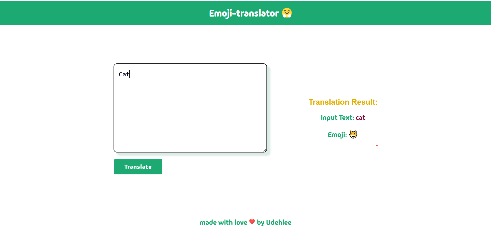

## Emoji Translator

## Description
The Emoji Translator is a an interactive tool designed to convert text into corresponding emojis. it has a user-friendly interface for easy 
navigation and usage.

## preview

## Usage
- Enter the text you want to translate into the text box.
- Click the translate button to convert the text into emojis.
-  The translated inputted text with the corresponding emojis is displayed for easy viewing.

## Technologies Used:
- Go 
- HTML
- CSS

## Installation:
- Clone the repository

https://github.com/Udehlee/Emoji-translator.git

- cd into the clone repository

- run main.go in the terminal

- open localhost/8080 on your browser

## Limitations:
- only a handful of emojis are linked to the input text.

